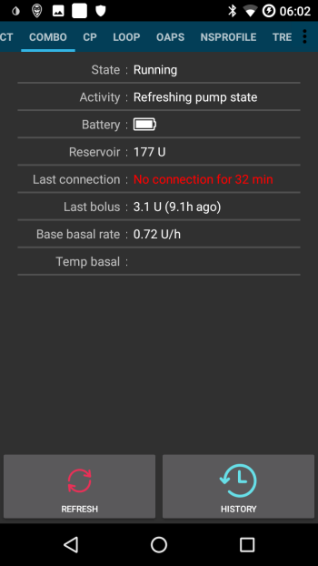
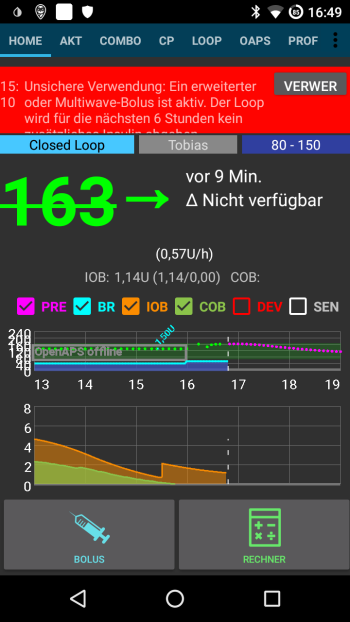
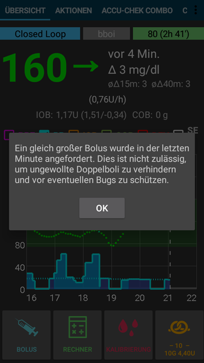

# Accu-Chek Combo conseils pour une utilisation de base

## Comment assurer les opérations en douceur

* Toujours **porter le smartphone avec vous**, laissez-le à côté de votre lit la nuit.
* Toujours vérifiez toujours que la batterie de la pompe est aussi complète que possible. Reportez-vous à la section de la batterie pour obtenir des conseils concernant la batterie.
* Il est préférable de **ne pas toucher à l'application Ruffy** pendant que le système fonctionne. Si l'application est redémarrée, la connexion à la pompe peut s'arrêter. Une fois que la pompe est connectée à la Ruffy, il n'est pas nécessaire de la reconnecter. Même après un redémarrage du téléphone, la connexion est automatiquement rétablie. Si possible, déplacez l'application vers un écran inutilisé ou dans un dossier de votre smartphone afin de ne pas l'ouvrir accidentellement.
* Si vous ouvrez involontairement l'application Ruffy pendant le bouclage, il est préférable de redémarrer le smartphone immédiatement.
* Dans la mesure du possible, n'utiliser la pompe que via l'application AndroidAPS. Pour faciliter cela, activez le verrouillage sur la pompe sous **Réglages pompe / Verrouillage des touches / On**. Ce n'est que lorsque vous changez la pile ou la cartouche qu'il est nécessaire d'utiliser les touches de la pompe. 

## Pompe inaccessible. Que faire ?

### Activer l'alerte pompe inaccessible
* Dans AndroidAPS, accédez à ** Paramètres / Alertes locales ** et activez **Alerte si la pompe est hors de portée** et paramétrez **Seuil alerte pompe hors de portée [min]** à **31** minutes.
* Cela vous donnera suffisamment de temps pour ne pas déclencher l'alarme quand vous quittez une pièce en laissant le téléphone sur le bureau, mais vous informe si la pompe n'est pas joignable pour une durée supérieure à celle d'un d'un débit de base temporaire.

### Restaurer l'accessibilité de la pompe
* Quand AndroidAPS signale un alarme **pompe injoignable**, deverrouillez d'abord la pompe et **appuyez syr n'importe quelle touche de la pompe** (par ex. Dès que l'affichage de la pompe s'est étient, appuyez sur **ACTUALISER** dans **l'onglet Combo** dans AndroidAPS. La plupart du temps la communication fonctionnera à nouveau.
* Si cela ne marche pas, redémarrez votre smartphone. Après le redémarrage, AndroidAPS et ruffy seront réactivés et une nouvelle connexion sera établie avec la pompe.
* Les tests avec différents smartphones ont montré que certains smartphones déclenchaient l'erreur "pompe injoignable" plus souvent que d'autres. La [liste des téléphones testés](https://docs.google.com/spreadsheets/d/1gZAsN6f0gv6tkgy9EBsYl0BQNhna0RDqA9QGycAqCQc/edit#gid=698881435) liste les smartphones testés avec succès avec AAPS.

### Causes racines et conséquences des fréquentes erreurs de communication
* Sur les téléphones avec **peu de mémoire** (ou des réglages **aggressifs d'économie d'énergie**), AndroidAPS est souvent fermé. Vous pouvez le constater par le fait que les boutons Bolus et Calculatrice sur l'écran d'accueil ne sont pas affichés lors de l'ouverture d'AAPS car le système est en cours d'initialisation. Cela peut déclencher une alerte "Pompe hors de portée" au démarrage. Dans le champs **Dernière connexion** de l'onglet Combo, vous pouvez vérifier quand AndroidAPS a communiqué pour la dernière fois avec la pompe.

 

* Cette erreur peut vider la pile de la pompe plus rapidement car le profil basal est lu à partir de la pompe lorsque l'application est redémarrée.
* Cela augmente également la probabilité de provoquer l'erreur qui amène la pompe à rejeter toutes les connexions entrantes jusqu'à ce qu'un bouton de la pompe soit enfoncé.

## Echec de l'annulation du débit de base temporaire
* Occasionnellement, AndroidAPS ne peut pas annuler automatiquement une alerte **DBT ANNULEE**. Dans ce cas, vous devez soit appuyer sur **ACTUALISER** dans **l'onglet Combo ** de AndroidAPS soit confirmer l'alarme sur la pompe.

## Considérations relatives à la pile

### Changer la pile
* Après une alarme **Pile pompe faible**, la pile doit être changée le plus rapidement possible pour toujours avoir l'énergie nécessaire à une communication Bluetooth fiable avec le smartphone, même si le téléphone se trouve à une grande distance de la pompe.
* Même après une alarme **Pile pompe faible**, la pile peut être utilisée pour une durée significative. Il est cependant recommandé de toujours avoir une pile neuve avec vous après une alarme "Niveau Batterie Bas".
* Pour ce faire, faites un appui long sur **Boucle Fermée** dans l'écran principal et sélectionnez **Suspendre la Boucle pour 1h**.
* Attendez que la pompe communique avec le téléphone et que le logo Bluetooth sur la pompe se soit estompé.

* Déverrouillez les touches de la pompe, mettez la pompe à l'arrêt, confirmez si nécessaire l'annulation du débit de base temporaire changez la pile.
* Ensuite, redémarrez la pompe, faites un appui long sur **Suspendu** dans l'écran principal d'AAPS et sélectionnez **Reprendre**.
* AndroidAPS redéfinira si nécessaire un nouveau Débit de Base Temporaire lors de l'arrivée de la prochaine glycémie.

### Type de pile et causes de faible autonomie
* Comme la communication Bluetooth intensive consomme beaucoup d'énergie, n'utilisez que des **piles de haute qualité** comme Energizer Ultimate Lithium, les "power one" du service pack Accu-Chek "étendu", ou si vous utilisez des batteries rechargeables, utilisez les batteries Eneloop.

 

Les durées de vie standards des différents types de batterie sont les suivantes :
* **Energizer Ultimate Lithium** : 4 à 7 semaines
* **Power One Alcaline** (Varta) à partir du servcie pack : 2 à 4 semaines
* Batteries **Eneloop rechargeables** (BK-3MCCE) : 1 à 3 semaines

Si la durée de vie de votre pile est significativement inférieure à celle indiquée ci-dessus, vérifiez les causes possibles suivantes :
* La dernière version de [l'application Ruffy](https://github.com/MilosKozak/ruffy) (mars 2018) améliore significativement la durée de vie de la pile de la pompe. Assurez-vous que vous êtes sur cette version si vous avez des problèmes de durée de vie de la pile.
* Il y a quelques variantes du capuchon de pile de la pompe Combo, qui court-circuite partiellement les piles et les vide rapidement. Les capuchons sans ce problème sont reconnaissables par les contacts dorés.
* Si l'horloge interne de la pompe ne "survie" pas un changement de pile court, il est probable que le condensateur qui maintient l'horloge en marche soit cassé. Dans ce cas, seul un remplacement de la pompe par Roche vous aidera, ce qui n'est pas un problème pendant la période de garantie.
* Le hardwre et le software du smartphone (version de l'OS Android et de la puce bluetooth) ont aussi un impact sur la durée de vie de la pile de la pompe, même si les raisons exactes ne sont pas encore complètement connues actuellement. Si vous en avez l'occasion, essayez un autre smartphone et comparez la durée de vie de la pile.

## Changement d'heure (été ou hiver)
* Actuellement, le pilote combo ne prend pas en charge l'ajustement automatique de l'heure de la pompe.
* Pendant la nuit d'un changement d'heure, l'heure du smartphone est mise à jour, mais l'heure de la pompe reste inchangé. Cela conduit à une alarme en raison du décalage des heures entre les systèmes à 3 heures du matin.
* Si vous ne souhaitez pas être réveillé la nuit, **désactivez Date et heure automatiques sur le téléphone mobile** dans la soirée avant le changement d'heure et ajustez-vous les heures manuellement le lendemain matin.

## Bolus étendus, bolus mixtes
L'algorithme OpenAPS ne prend pas en charge un bolus carré étendu ou un bolus mixte. Mais un traitement similaire peut être réalisé à l'aide de l'alternative suivante :
* Entrez les glucides mais pas le bolus correspondant. L'algorithme de boucle réagira plus agressivement. Si nécessaire, utilisez **eCarbs** (glucides étendus).

* Si vous êtes tenté d'utiliser les bolus étendus ou mixtes directement sur la pompe, AndroidAPS vous pénalisera avec la désactivation de la boucle fermée pendant les six heures suivantes afin de vous assurer qu'aucune dose excessive d'insuline n'est délivrée.

## Alarmes à l'administration du bolus
* Si AndroidAPS détecte qu'un bolus identique a été délivré avec succès pendant la même minute, le 2ème bolus avec la même quantité d'insuline ne sera pas injecté. Si vous voulez vraiment faire deux bolus de suite avec la même quantité d'insuline, il suffit d'attendre deux minutes de plus, puis refaire le nouveau bolus. Si le premier bolus a été interrompu ou n'a pas été délivré pour d'autres raisons, vous pouvez refaire immédiatement le bolus depuis AAPS 2.0.
* La raison de ce mode de fonctionnement est un mécanisme de sécurité qui fonctionne en arrière plan, et qui va lire l'historique des bolus de la pompe avant d'administrer un nouveau bolus pour calculer correctement l'insuline active (IA), même quand un bolus est administré directement sur la pompe. Pour cela, il faut éviter les entrées multiples identiques.

* Ce mécanisme est également responsable d'une deuxième source d'erreur: si, lors de l'utilisation de la calculatrice, un autre bolus est administré via la pompe et donc l'historique des bolus change, la base du calcul du bolus est erronée et le bolus est abandonné.

